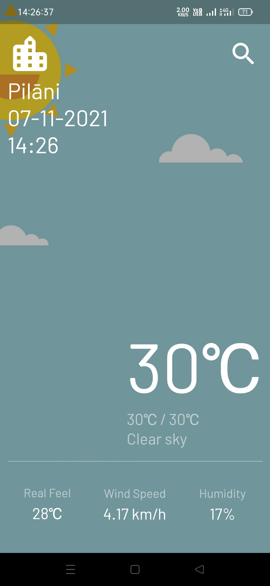
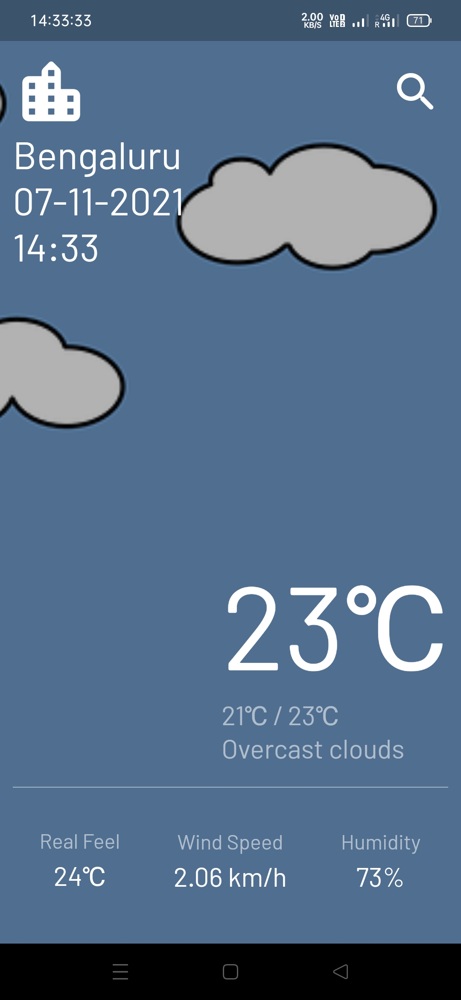
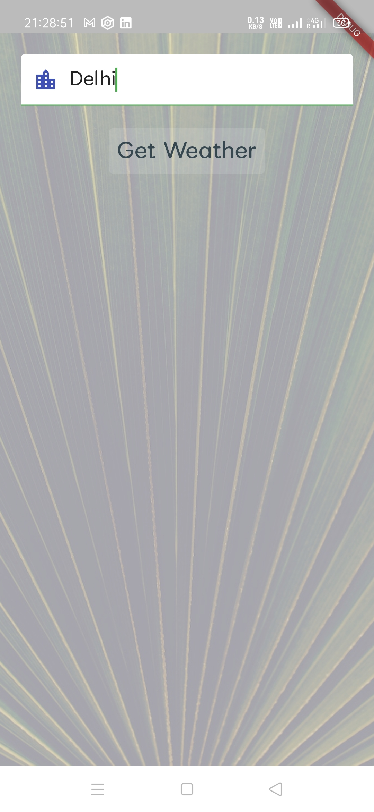

# weather_app

This is a Flutter application to get weather for the current location as well as custom locations. In this application I have used [Current weather data API](https://openweathermap.org/current) provided by Openweathermap to get the current weather data of the current location as well as user provided location. This app has a pull to refresh feature which is used to refresh the latest weather report of the current device location. The background of the homepage changes according to the weather.

# Screenshots

## Demo 1

## Demo 2

## Demo 3
