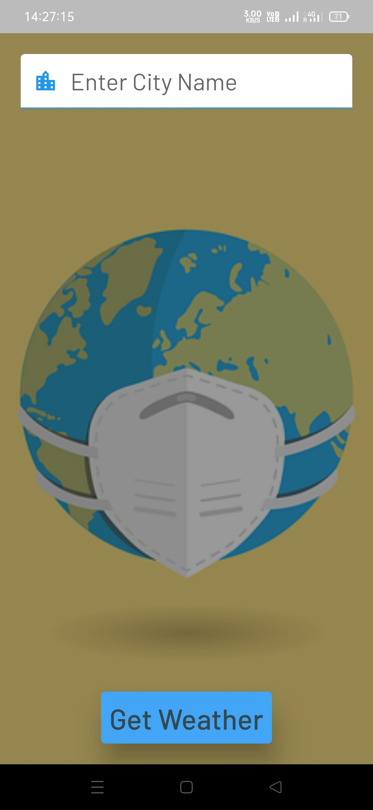

# weather_app

This is a Flutter application to get weather for the current location as well as custom locations. In this application I have used [Current weather data API](https://openweathermap.org/current) provided by Openweathermap to get the current weather data of the current location as well as user provided location.

# Screenshots

## Demo 1

## Demo 2
